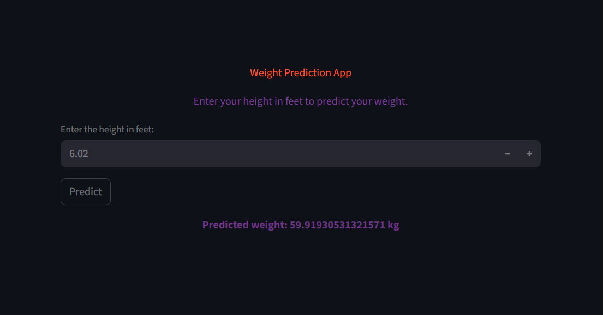

# Weight_from_Height (Streamlit App)

A simple Streamlit app that predicts body weight (in kg) based on a user's height (in feet), using a basic linear regression model trained on real-world anthropometric data. Built for clarity, not complexity.

> Predicts weight from height using a minimal regression model and a Streamlit frontend.

---

## What it does
- Takes user input for height (in feet)
- Loads a pre-trained linear regression model
- Predicts body weight (in kg) with a single click
- Displays the result with basic UI styling in Streamlit

---

## Files included
- `SOCR-HeightWeight.csv` — raw dataset used for training
- `Height_to_Weight_Converter.ipynb` — notebook for EDA and model training
- `final_model.pkl` — saved scikit-learn model
- `app.py` — main Streamlit interface

---

## Demo

